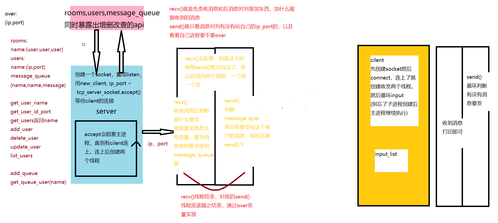

## 计网课设：简易Socket聊天室

使用`python`实现一个简单的`socket`聊天室

### 功能

- [x] 一对一聊天
- [x] 群发
- [x] 聊天室
- [ ] 发送文件
- [ ] UI界面

### 优点

- [x] 处理各种连接异常
- [x] 多线程操作
- [x] 相对独立的模块
- [ ] 统一的接口设计
- [ ] 对接口接收的数据进行验证

### 使用方式

服务器端配置端口号，在终端执行`server.py`文件。客户端填写服务器`ip`地址和端口号，执行`cilent.py`文件连接服务器。客户端可以使用以下命令：

| 指令                                         | 作用                                   |
| -------------------------------------------- | -------------------------------------- |
| `list users`                                 | 列出当前在线用户                       |
| `send message user1,user2 this is a message` | 发送消息（用逗号隔开在线用户可以群发） |
| `create room room1 yuanyuan,yvyv`            | 创建聊天室                             |
| `list rooms`                                 | 列出所有聊天室                         |
| `send room1 this is a message`               | 向聊天室发送消息                       |

关闭客户端直接关掉终端或者`ctrl+c`都是可以的，服务器对异常作了处理，断开后会关闭相应的两个线程。

### 结构图



### 文件结构

`client.py`是客户端，`server.py`是服务器，`process.py`和`model.py`是需要导入`server.py`的文件，要和`server.py`放在相同文件夹下。

#### 客户端

`client.py`实现了结构图最右边的内容

```python
import socket
import threading

ip="192.168.137.81"
port=9092
input_list=[]
client_over=[False]

#send会循环读取input_list,主线程会在input_list里放入消息
input_list_lock=threading.Lock()

def thread_send_function():
    while not client_over[0]:
        if len(input_list)!=0:
            message=input_list[0]
            input_list_lock.acquire()
            del input_list[0]
            input_list_lock.release()
            cilent_socket.send(message.encode('gbk'))

def thread_recv_function():
    while True:
        try:
            message = cilent_socket.recv(1024)
        except (ConnectionResetError, ConnectionAbortedError):
            #print("ConnectionResetError")
            client_over[0]=True
            break
        else:
            if message:
                print(message.decode('gbk'))

            else:
                #结束主进程 实际上服务器不会主动结束，应该不走这个逻辑
                #print("disconnected with:"+ip+" "+str(port))
                
                #要想访问必须得是引用赋值，可能不同线程之间的变量是共享的指针吧（乱猜）
                client_over[0]=True
                break

cilent_socket=socket.socket(socket.AF_INET, socket.SOCK_STREAM)
try:
    cilent_socket.connect((ip, port))
except Exception as result:
    print(result)
    pass
else:
    #连接成功后的逻辑
    print("connected with:"+ip+" "+str(port))
    thread_send=threading.Thread(target=thread_send_function, daemon=True)
    thread_recv=threading.Thread(target=thread_recv_function, daemon=True)
    thread_recv.start()
    thread_send.start()
    #线程创建好后执行循环
    while not client_over[0]:
        try:
            #断开连接后client_over[0]会被置为true，回车后解阻塞退出
            message=input()
        except KeyboardInterrupt:
            break
        else:
            input_list_lock.acquire()
            input_list.append(message)
            input_list_lock.release()
finally:
    #调用close方法是个好习惯
    cilent_socket.close()
    print("bye bye")import socket
import threading

ip="192.168.137.81"
port=9092
input_list=[]
client_over=[False]

#send会循环读取input_list,主线程会在input_list里放入消息
input_list_lock=threading.Lock()

def thread_send_function():
    while not client_over[0]:
        if len(input_list)!=0:
            message=input_list[0]
            input_list_lock.acquire()
            del input_list[0]
            input_list_lock.release()
            cilent_socket.send(message.encode('gbk'))

def thread_recv_function():
    while True:
        try:
            message = cilent_socket.recv(1024)
        except (ConnectionResetError, ConnectionAbortedError):
            #print("ConnectionResetError")
            client_over[0]=True
            break
        else:
            if message:
                print(message.decode('gbk'))

            else:
                #结束主进程 实际上服务器不会主动结束，应该不走这个逻辑
                print("disconnected with:"+ip+" "+str(port))
                #要想访问必须得是引用赋值，可能不同线程之间的变量是共享的指针吧（乱猜）
                client_over[0]=True
                break

cilent_socket=socket.socket(socket.AF_INET, socket.SOCK_STREAM)
try:
    cilent_socket.connect((ip, port))
except Exception as result:
    print(result)
    pass
else:
    #连接成功后的逻辑
    print("connected with:"+ip+" "+str(port))
    thread_send=threading.Thread(target=thread_send_function, daemon=True)
    thread_recv=threading.Thread(target=thread_recv_function, daemon=True)
    thread_recv.start()
    thread_send.start()
    #线程创建好后执行循环
    while not client_over[0]:
        try:
            #断开连接后client_over[0]会被置为true，回车后解阻塞退出
            message=input()
        except KeyboardInterrupt:
            break
        else:
            input_list_lock.acquire()
            input_list.append(message)
            input_list_lock.release()
finally:
    #调用close方法是个好习惯
    cilent_socket.close()
    print("bye bye")
```

#### 服务器

`server.py`实现了监听客户端连接请求和创建收发线程。`recv`线程收到的字节流会交给`process`处理，`send`线程循环读取消息队列和客户端状态

```python
import socket
import threading
from process import *

server_port=9092
over=[]

#某个线程操控全局变量的时候锁住
lock=threading.Lock()


def thread_send_function(ip_port,server_socket):
    #不断判断消息队列中有没有发给ip_port的消息，判断当前客户端是否结束
    while ip_port not in over:
        lock.acquire
        mail_list= get_mails_filter(ip_port)
        lock.release
        for i in mail_list:
            lock.acquire
            del_mails(i)
            lock.release
            (sender,receiver,mail)=i #解包赋值
            message=sender+': '+mail
            server_socket.send(message.encode('gbk'))
    #把ip_port从over里删除
    over.remove(ip_port)

def thread_recv_function(ip_port,server_socket):
    print("Connected with",*ip_port)
    #设置用户名初始化
    lock.acquire
    add_mail("server",ip_port,"set your name please:")
    lock.release
    try:
        message = server_socket.recv(1024)
        lock.acquire
        add_user(ip_port,message.decode('gbk'))
        lock.release
        add_mail("server",ip_port,"let's start chatting!")
        if DEBUG:
            print(ip_port,":",message.decode('gbk'))
    except (ConnectionResetError, ConnectionAbortedError):
        print("disconnected with:",*ip_port)
        over.append(ip_port)
    else:
        #正常收消息并处理
        while True:
            try:
                message = server_socket.recv(1024)
            except (ConnectionResetError, ConnectionAbortedError):
                print("disconnected with:",*ip_port)
                over.append(ip_port)
                break
            else:
                if message:
                    #处理收到的message
                    lock.acquire
                    process(message,ip_port,server_socket)
                    lock.release
                else:
                    #结束这个服务器的线程 其实每次客户端都是强制断开，所以走的是抛异常的路
                    print("disconnected with:",*ip_port)
                    over.append(ip_port)
                    break
    finally:
        server_socket.close()
        #清空全局变量里有关该客户端的内容
        lock.acquire
        mail_list= get_mails_filter(ip_port)
        for i in mail_list:
            lock.acquire
            del_mails(i)
            lock.release
        del_member_from_rooms(get_user_name(ip_port))
        delete_user(get_user_name(ip_port))
        lock.release
        if DEBUG:
            print(rooms,users)


server_socket = socket.socket(socket.AF_INET, socket.SOCK_STREAM)
server_socket.setsockopt(socket.SOL_SOCKET, socket.SO_REUSEADDR, True)
server_socket.bind(("", server_port))
server_socket.listen(128)

while True:
    new_client, ip_port = server_socket.accept()

    thread_send=threading.Thread(target=thread_send_function, args=(ip_port,new_client),daemon=True)
    thread_recv=threading.Thread(target=thread_recv_function, args=(ip_port,new_client),daemon=True)
    thread_send.start()
    thread_recv.start()
```

`process.py`用于处理收到的字节流，会调用`model.py`提供的全局变量和一些函数，根据字节流的命令修改相应的全局变量，这个过程是上锁的

```python
from model import *
import re

DEBUG=True

def process(message,ip_port):
    message=message.decode("gbk")

    #send message yuanyuan hello
    match=re.match(r'^send message (\w+(,\w+)*)\s+(.*)$', message)
    if match:
        receivers = match.group(1).split(',')
        message = match.group(3)
        for receiver in receivers:
            add_mail(get_user_name(ip_port),get_user_id_port(receiver),message)
        if DEBUG:
            print("send message",receivers,message)

    #list users
    match=re.match(r'^list users$', message)
    if match:
        users= ', '.join(get_users())
        add_mail("server",ip_port,users)
        if DEBUG:
            print("list users",users)

    #list rooms
    match=re.match(r'^list rooms$', message)
    if match:
        rooms= ', '.join(get_rooms())
        add_mail("server",ip_port,rooms)
        if DEBUG:
            print("list rooms",rooms)
    
    #create room room1 yuanyuan
    match=re.match(r'^create room (\w+)\s+([\w,]+)$',message)
    if match:
        room_name = match.group(1)
        members = match.group(2).split(',')
        create_rooms(room_name,members)
        if DEBUG:
            print("create room",room_name,members)

    #send room room1 hello
    match=re.match(r'^send room (\w+)\s+(.*)$',message)
    if match:
        room_name = match.group(1)
        message = match.group(2)
        for member in get_room_members(room_name):
            add_mail(room_name,get_user_id_port(member),message)
        if DEBUG:
            print("send room",room_name,message)
    

if __name__=="__main__":
    message="send room room1 hello"

    match = re.match(r'^send message (\w+(,\w+)*)\s+(.*)$', message)
    if match:
        receivers = match.group(1).split(',')
        message = match.group(3)
        print("Receivers:", receivers)
        print("Message:", message)
    

    match=re.match(r'^create room (\w+)\s+([\w,]+)$',message)
    if match:
        room_name = match.group(1)
        user_names = match.group(2).split(',')
        print("Room name:", room_name)
        print("User names:", user_names)

    match=re.match(r'^send room (\w+)\s+(.*)$',message)
    if match:
        room_name = match.group(1)
        message = match.group(2)
        print("Room name:", room_name)
        print("Message:", message)

import socket
import threading
from process import *

server_port=9092
over=[]

#某个函数操控全局变量的时候锁住
lock_func=threading.Lock()


def thread_send_function(ip_port,server_socket):
    #不断判断消息队列中有没有发给ip_port的消息，判断当前客户端是否结束
    while ip_port not in over:
        lock_func.acquire
        mail_list= get_mails_filter(ip_port)
        lock_func.release
        for i in mail_list:
            lock_func.acquire
            del_mails(i)
            lock_func.release
            (sender,receiver,mail)=i #解包赋值
            message=sender+': '+mail
            server_socket.send(message.encode('gbk'))
    #把ip_port从over里删除
    over.remove(ip_port)

def thread_recv_function(ip_port,server_socket):
    print("Connected with",*ip_port)
    #设置用户名初始化
    lock_func.acquire
    add_mail("server",ip_port,"set your name please:")
    lock_func.release
    try:
        message = server_socket.recv(1024)
        lock_func.acquire
        add_user(ip_port,message.decode('gbk'))
        add_mail("server",ip_port,"let's start chatting!")
        lock_func.release
        if DEBUG:
            print(ip_port,":",message.decode('gbk'))
    except (ConnectionResetError, ConnectionAbortedError):
        print("disconnected with:",*ip_port)
        over.append(ip_port)
    else:
        #正常收消息并处理
        while True:
            try:
                message = server_socket.recv(1024)
            except (ConnectionResetError, ConnectionAbortedError):
                print("disconnected with:",*ip_port)
                over.append(ip_port)
                break
            else:
                if message:
                    #处理收到的message
                    lock_func.acquire
                    process(message,ip_port)
                    lock_func.release
                else:
                    #结束这个服务器的线程 其实每次客户端都是强制断开，所以走的是抛异常的路
                    print("disconnected with:",*ip_port)
                    over.append(ip_port)
                    break
    finally:
        server_socket.close()
        #清空全局变量里有关该客户端的内容
        lock_func.acquire
        mail_list= get_mails_filter(ip_port)
        lock_func.release
        for i in mail_list:
            lock_func.acquire
            del_mails(i)
            lock_func.release
        lock_func.acquire
        del_member_from_rooms(get_user_name(ip_port))
        delete_user(get_user_name(ip_port))
        lock_func.release
        if DEBUG:
            print(rooms,users)


server_socket = socket.socket(socket.AF_INET, socket.SOCK_STREAM)
server_socket.setsockopt(socket.SOL_SOCKET, socket.SO_REUSEADDR, True)
server_socket.bind(("", server_port))
server_socket.listen(128)

while True:
    new_client, ip_port = server_socket.accept()

    thread_send=threading.Thread(target=thread_send_function, args=(ip_port,new_client),daemon=True)
    thread_recv=threading.Thread(target=thread_recv_function, args=(ip_port,new_client),daemon=True)
    thread_send.start()
    thread_recv.start()
```

`model.py`提供了一些全局变量和一些操作全局变量的接口

```python
import threading

rooms={}
users={}
mail_queue=[]

#某个线程操控全局变量的时候锁住
lock=threading.Lock()

#users
def get_user_name(ip_port):
    with lock:
        for k,v in users.items():
            if v==ip_port:
                return k
        
def get_user_id_port(name):
    with lock:
        return users[name]

def get_users():
    with lock:
        return users.keys()

def add_user(ip_port,name):
    with lock:
        users[name]=ip_port

def delete_user(name):
    with lock:
        if name in users:
            del users[name]


#mails
def add_mail(sender,receiver,mail):
    with lock:
        mail_queue.append((sender,receiver,mail))
    #筛选发给这个ip_port的信息

def get_mails_filter(ip_port):
    with lock:
        mail_list=[]
        for i in range(len(mail_queue)):
                if mail_queue[i][1]==ip_port:
                    mail_list.append(mail_queue[i])
        return mail_list

def del_mails(mail):
    with lock:
        #总是搭配get_mails_filter使用，所以不用担心找不到
        mail_queue.remove(mail)


#rooms
def create_rooms(room_name,member_list):
    with lock:
        rooms[room_name]=member_list

def get_room_members(room_name):
    with lock:
        return rooms[room_name]

def get_rooms():
    with lock:
        return rooms.keys()

def del_member_from_rooms(name):
    with lock:
        empty_rooms=[]
        for room_name,members in rooms.items():
            if name in members:
                members.remove(name)
                if not members:
                    empty_rooms.append(room_name)
        for room_name in empty_rooms:
            del rooms[room_name]
    

if __name__=="__main__":
    #user
    add_user(("123.1",221),"yuanyuan")
    add_user(("123.1",222),"yuanyuan2")
    add_user(("123.1",223),"yuanyuan3")
    delete_user("yuanyuan")
    print(get_users())
    print(get_user_name(("123.1",223)))
    print(get_user_id_port("yuanyuan2"))
    add_user(("123.1",221),"yuanyuan")
    #mail
    add_mail("yuanyuan",("123.1",222),"你好啊笨比")
    add_mail("yuanyuan2",("123.1",221),"你好啊比")
    add_mail("yuanyuan2",("123.1",221),"你好笨比")
    print(get_mails_filter(("123.1",221)))
    del_mails(('yuanyuan2', ("123.1",221), '你好笨比'))
    #rooms
    create_rooms("room1",["yuanyuan","yvyv"])
    create_rooms("room2",["yuanyuan","yvyv","hh"])
    print(get_room_members("room1"))
    del_member_from_rooms("yuanyuan")
    print(get_room_members("room1"))
    del_member_from_rooms("yvyv")
    print(get_rooms())
```

### 总结

`websocket`可以让服务器向客户端发送字节流。

### python基础补充

#### 了解下多线程

```py
import threading
#返回当前线程
threading.current_thread()
#创建线程
sing_thread = threading.Thread(target=sing)
#执行线程
sing_thread.start()
# args: 以元组的方式给任务传入参数
def task(count):
sub_thread = threading.Thread(target=task, args=(5,))

#线程之间是无序的
#子线程启动后主线程继续执行
#主线程等待子线程结束后结束，可以设置守护进程，主进程结束后立即结束子进程
sub_thread = threading.Thread(target=show_info, daemon=True)

#线程共享全局变量，线程内定义的变量不共享
#因为无序执行导致变量结果出错，线程同步:有序执行，线程1执行结束前会阻塞
first_thread.join()
#线程锁
mutex = threading.Lock()

# 一个锁只能有一个线程用，其他的acquire会阻塞，所以一个线程结束前一定要release!
mutex.acquire()
mutex.release()
```

写这个项目时遇到了一个数组被同一函数并行调用的情况，总结是函数内上锁可以防止某个函数并行，函数调用前上锁防止不同函数并行。

#### *和**

函数定义时

```python
# *以元组方式收集多余没指明变量的参数
def myprint(x,*params):
    print(params)
myprint(1,2,3)
（2,3）
# 以字典方式收集指明变量的参数
def myprint2(**params):
    print(params)
myprint2(x=1,y=2,z=3)
{'z':3,'x':1,'y':2}
```

调用函数时

```python
def myprint(x,y):
    print(x)
    print(y)
    
params={'x':1,'y':2}
myprint(**params)
params=(1,2)
myprint(*params)
#结果都是1,2
```

#### socket模块

流程图


1. 必须有一个`socket`要置为`listen`状态作为服务器

2. 传输的是 `bytes` 类型的数据，所以要将字符串编码再进行传输

3. 对accept返回的`cilent`调用`close`，这个客户端结束通讯；对监听状态的`socket`调用`close`，新的客户端将不能连接服务端，但是之前已经接成功的客户端还能正常通信。
4. 当客户端的套接字调用 `close` 后，服务器端的 `recv` 会解阻塞，返回的字节流长度为0，服务端可以通过返回数据的长度来判断客户端是否已经下线，反之服务端关闭套接字，客户端的 `recv `也会解阻塞，返回的数据长度也为0。断开连接有两种可能，第一种可能是调用了close。第二种可能是进程奔溃网络问题之类的导致的强行断开，这时候另一端的`recv`方法会抛出如`ConnectionResetError`和`ConnectionAbortedError`异常

#### 异常

```python
try:
 f = open('test.txt', 'r')
except Exception as result:
    #Exception是所有程序异常类的⽗类
 f = open('test.txt', 'w')
else:
#else表示的是如果没有异常要执⾏的代码
 print('没有异常，真开⼼')
finally:
#inally表示的是⽆论是否异常都要执⾏的代码，例如关闭⽂件
 f.close(
```
